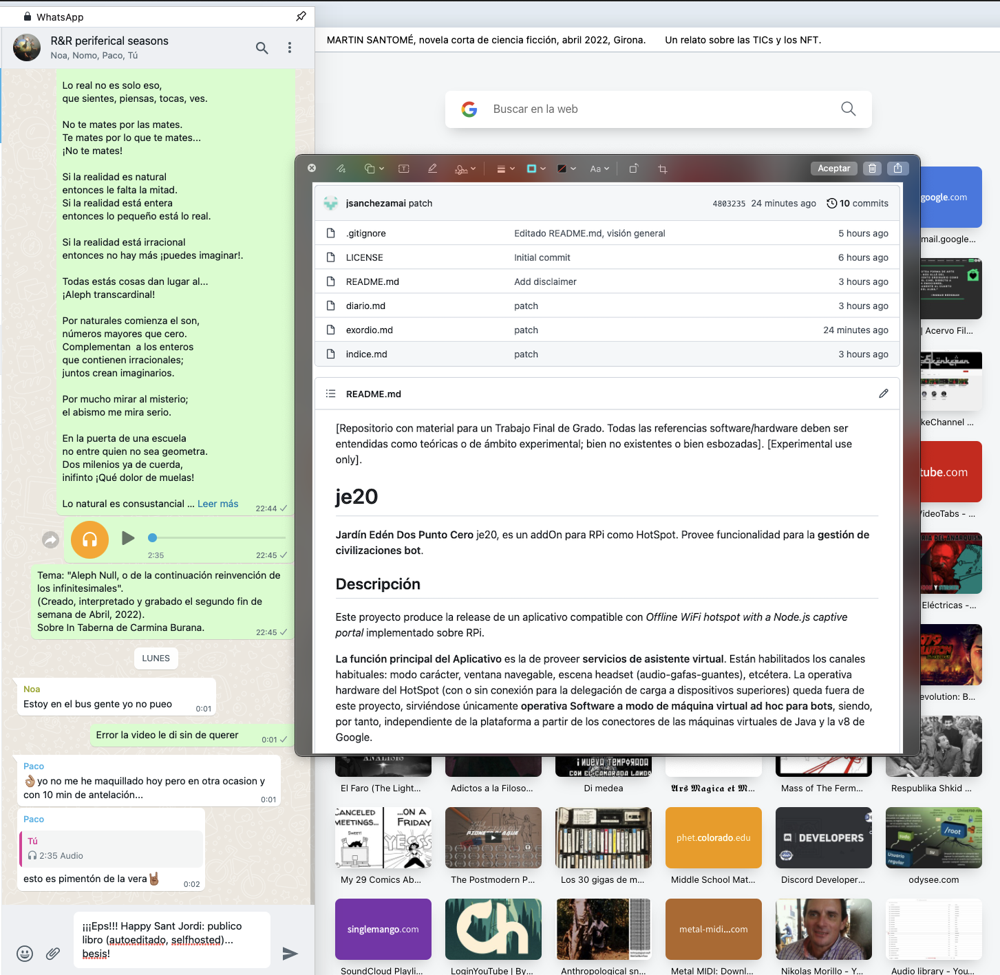

From: Álex S <alex@mail.com>  
Date: Sun, 24 Apr 2022 13:17:31 +0200  
Subject: Re: 1a partida federado  
To: Un maestro apócrifo <maestro@mail.com>  

Hola don Fernando,

La última vez que le escribí lo hice fuera de educación. Ya pedí perdón, pero ahora "hago" el perdón. Le invito a la lectura de una pequeña pieza literaria muy suculenta. Esta invitación pretende el acto de reparación.

Le envío un enlace. Es una pieza literaria breve, apenas si veinte minutos de lectura.

Es mi obra prometida. ¿Qué edad tenías cuando los Gárgoris?

La visita del enlace que le pongo es free (gratis y público) y se efectúa en una plataforma de Microsoft.

Se autoexplica.

Abajo le pongo el enlace y el grafismo de portada.

Así, me sentía en deuda, y, creo, lo que esta obrita pretende, es la diana de un camino de mi corazón, como un obsequio para el que considero ha sido mi no-maestro capaz de enseñarme en la meseta de la España que hiela corazones y, también, teleológico discípulo, en la distancia del autor/espectador, sin, ¡jamás! traspasar la cuarta pared, maestro capaz volarme al beat occidental o al karma oriental; por citar dos de los grandes fuegos de redes culturales. 

Fernando, aquí tiene, en apenas embrión, storyboard, guión germinal, tras el enlace que le indico, en formato texto plano, los bocetos para "la novela que NO querrías leer; pero que no puedes evitar leer". :-D Carita sorriente. 

Tras el enlace que adjunto, si el editor quiere, esto que presento, ya merece un adelanto; y reservar hueco en librerías. 

No negaré que la labor de confección de tamaño proyecto sería titánica solo al alcance de vocacionales obreros de catedral. Por supuesto, siempre, todo adelanto o inversión, conlleva un riesgo.

En mi caso, el furor devOps, como panorama de esta época en la que significo un mero developer con escasas cargas operativas (huyo de ellas como de la peste!! te atan a una máquina concreta, y no te dejan viajar!), aclarar, salgo remunerado por un teletrabajo suficientemente mediocre en conformidad de la octava de las potencias mundiales y su PIB, pero suficientemente estable como para comprar tal y como mi padre me tiene enseñado: a toca teja. Jamás aceptaría un céntimo ni de editor ni de mecenas que pudieran, en lo más mínimo, influir en su confección. Quede dicho.

Tras abordar su cotidiano con tales palabras gruesas, en el último correo, me sentí en deuda; y, si pedí perdón, con este regalo, ahora intento "hacerlo", tratando de compensar tal último correo fuera de tono con una lujuriosa y agridulce-lectura. 

Desde un estado cuerdo, cabal y acorde con lo sano, justificar mi comportamiento en tal lance, fuera de tono por tan hondo esta vez (le hablo de la pérdida de Escohotado y de querer emular con químicos) casi doy paso en falso. Habían pasado largos meses de crisálida y la salida no fue tan grácil como cabía esperar de una mariposa hecha y derecha.

¡¡Es curioso cómo cuesta ese último paso de metamorfosis: la crisálida no aguanta toda quebrada, el gusano ya con alas, y, sin embargo, todavía hay que dar el primer aleteo!! 

Si, en el eterno intento de emular al maestro, quisiera emular el levantar una catedral, [de eso va la historia que presento] intento identificar la España, como escena y espacio, e intento identificar lo Mágico, como carga ontológica; entonces, Aldea Global e Información.

Como escritor, odio escribir de estos temas.

Doy fe que mis abuelos son uno del bando nacional y otro de los que salieron Almería arriba en la estampá, y que, aún y lo roto de la España de guerra civil, prefiero eso a lo de la Aldea Global.

Igual, lo mismo, ¿acaso ya se agotaron los ríos espirituales de oriente, ya se murió del todo el latín y el griego? ¿Por qué hablar de Información como la magia de las magias o de una magia de magias? Etcétera...

Como escritor, la Aldea Global y la Información, me vienen dadas y no son evitables.

Me preocupan las implicaciones morales de mi obra. Y, no puedo obviarlas porque me las impone la época. 

Ete ahí, Dionisio, que la obra es más para ti que para el patrón: esa idea fuerza en el subtítulo: "la obra que no puedes evitar leer; a pesar de lo escatológico y obsceno"... en este caso, exótero virtual, cibernético, arácnido, letal, mortal como transición de metempsicosis a lo artificial. 

La obra que traigo es escandalosamente escatológica y obscena, de inevitable, y sobre todo lujuriosa, lectura.

Efectivamente, a modo de exordio, ¡dígase si no levanta clickbait!: un computólogo nacido en el 78 comprende lo de la Transición entre formas de insuflar un pueblo. 

Toma como no-maestro (Nietzsche es el maestro y Jung el biógrafo) a un españolito a caballo las dos Españas del 36 comprende lo de la Transición entre formas de insuflar.

Y, pluma en mano, a tres décadas del ego incipiente, cúlmen de un proceso de iniciación informático tecnológico, tensa el arco, apunta la flecha y... deja cabo abierto para segunda parte... una idea para un segundo libro ajeno e independiente de este (el de presentación) el primero de la saga del "El Camino del Corazón" de este españolito que hoy te escribe, don Fernando.

Título de esta segunda obra:

España 2.0, un proyecto para la reforma del centro social democrático.

Subtítulo:

Una actualización y reflote de una unidad de destino en lo universal con ónfalo en las tierras donde Habidis hincó caracter. (Nota: No confundir el personaje histórico Habis con  la creación mítica Habidis; no tanto una rehistoria del Tartesos y la Península como una posthistoria de España como Provincia de la Aldea Global).

Pero bueno, siempre le leí que era conveniente llevar varias pelotas en el aire. Esto de la España 2.0 me tiene también entretenido. 

Parece que en cuarenta años de País (me refiero a los cuarenta y cuatro en que he vivido [por mor que Español vivo] en él) ha ocurrido un bigban democrático monopolar en Suarez; bipolar en PPPSOE; y ahora desguarrinjado de la alternancia de Cánovas.

Una España 2.0 que sea de centro y a la que quieran venir a jugar tanto los hijos de Abascal como los de Iglesias. Tú sabes, en las cosas virtuales quienes entran dejan sus mochilas en los vestuarios y solo cargan en su disfraz lo que les conviene; esto es, el avatar no es una copia exacta del usuario sino solo una mera careta.

El argumento de este otro libro, que sería posterior, vendría a estribar un qué digital-cibernético-virtual. Un qué como red de país. Un qué como punto para abordar en las posturas centristas de conveniencia y consenso y pacto de país. De interés general y bien común. 

Efectivamente, la España 2.0 pretende ser una novela de no ficción que prueba de trazar caminos en un laberinto, recorrer y marcar algunas salidas y algunos tramos angostos de una capa o de un subconjunto o de uno de los cuerpos de España en la segunda década del segundo milenio. 

Recorrer un laberinto, esta vez, menos conformado en texturas griegas de hace dos milenios y medio sino conformado artificial hasta la hez. 

Artificial de cabo a rabo. 

Artificialidad, esa es la Magia, no-maestro, de mi España, Artificialidad como esencia vertebrada allende los límites exteriores de la atmósfera donde constelaciones de satélites canalizan información, vertebrada aquende los suelos oceánicos donde gordos cables transportan datos.

Artificial hasta la hez fulgurando lucecitas, chivatitos y zumbidos en nuestras casas desde dispositivos robóticos y de inteligencia smart. 

No adelanto más, don Fernando. Ya dejo de intentar vender mi obra. ;-DDDDDD

Lo dicho, ahí quedan esos cuatro capitulillos que le enlazo para lectura, ¡lujuriosa!

Álex

https://github.com/jsanchezamai/je20/blob/main/diario.md

[PORTADA DEL LIBRO]

---------- Forwarded message ----------  
From: Álex S <alex@mail.com>  
Date: Sun, 24 Apr 2022 13:17:31 +0200  
Subject: Re: 1a partida federado  
To: Carlos Santomé Ordal <carlos@gmail.com>  

Buenas!!

Estoy de acuerdo con esas cuestiones. Marca bien el chess.com tres
inacuracies hasta llegar al dead-horse!!! :-DDD

He aprovechado este finde para "recopilar un poco" carpetas software
que tengo por ahí esparcidas con proyectos que vine haciendo esta
década.

En esa línea, como empecé eso de la Ingeniería Informática en la UNED
y tengo ya en vista el trabajo final de grado, he aprovechado ese
"recopilar un poco" para intentar salvar las mejores perlitas que haya
podido hacer. A ver si las puedo reaprovechar.

Aunque todavía estoy en la selección del tema; creo que tengo un
candidato: te lo presento (si tienes 5 minutos); es una cosa a largo
plazo así que no en plan ¡¡ahora!! sino para leer cuando se tenga un
rato de ocio!!!!!

Así, para aprovechar el finde y ser práctico, he decidido crear un
blog para empezar a preparar lo que será el proyecto final de grado.

Lo que en lugar de hacer un blog, uso la plataforma de microsoft
github, que es como un wordpress pero no para blogs sino para apps. La
dirección principal del sitio es:

https://github.com/jsanchezamai/je20

De este modo, planteo el TFG como un la entrega de "un producto"
comercializable "con cara, ojos y modelo de negocio". O sea,
aprovechar que tengo que entregar a la uni el TFG para levantar la
parte teórica de una app. Esto podría significar que al licenciarme
tendría un proyecto preparado para buscar capital y tratar de
manufacturar y comercializar.

Como sabes que tengo deformación de escritor, compuse dos
mini-capítulos así narrados como una historia narrativa para novela
(es decir, para que me entiendan los legos en TIC y en el mundo
digital). Estos dos cuentitos los escribí la semana pasada, de
almuerzo en almuerzo. Narra como dos hermanos mayores orbitan
alrededor del TFG del hermano pequeño. Intenta colar las ideas
teóricas que justifican la necesidad de la app, y trata de argumentar
las razones formales de su implementación haciéndolo bajo el manto de
un sitcom al uso con tres personajes y dos escenarios.

Teaser:
- https://github.com/jsanchezamai/je20/blob/main/indice.md

Capítulos enteros:
- https://github.com/jsanchezamai/je20/blob/main/diario.md

La idea es que por escribirlos fui entrando en una zona más alejada en
lo técnico. Y ya prescindiendo de cualquier atisbo literario, redacté
un estricto y formal y dogmático README al uso para presentar el
proyecto (es decir, para que los doctos y entendidos en informática no
objeten que hay una palabra de más). Es muy típico en todas las apps
que lo primero que se encuentre sea este fichero léeme donde se da la
bienvenida y presenta la aplicación. Puedes leerlo:

https://github.com/jsanchezamai/je20/blob/main/README.md

No sé si se percibe pero el producto viene a ser una especie de Alexa
o de Siri para ayudar a organizar los más que probables complejos
electrodomésticos que irán llegando en las próximas ornadas de
digitalización a los hogares. Electrodomésticos que ya alguno recibe
el pomposo nombre de "robot" como el de la Moulinex, aunque no importe
la marca comercial, y pronto, según Elon Musk, estarán disponibles en
formato roto de competi, en concesionarios, con un precio de venta
estimado, menor que el de un coche. Desde la domótica básica de luces,
clima y multimedia (esto ya presente en algunos hogares) hasta
complejas escenas lúdicas o industriales o educativas. La idea es que
en una habitación hay unos humanos usando esta app para, a su vez,
usar estos bots que a su vez manipulan algún robot. Creo, primo,
honestamente, que tiene suficiente punch como para un TFG. Por
supuesto de momento veo, como Álex, más lagunas que nítidos, pero me
parece que conjuga los elementos necesarios para buen candidato a tema
del TFG: tiene complejidad, se expresa en una idea palpable y se
ajusta a la época.

Bueno, nada... lo dicho, me escribiste una "primera vez" con esa
partida de ajedrez, y me apeteció compartir contigo otro "primera
vez". Si te apetece, salvo que abandone la idea en algún punto crítico
del camino (eso sería debidamente notificado), en este enlace te pongo
el agregador de noticias principal donde se va apuntando qué se ha
hecho o qué se ha aportado al proyecto, para que veas por dónde voy
inflando la cosa.

https://github.com/jsanchezamai/je20/commits/main

Supongo, que si se pone interesante y al final cuaja mi pretensión de
empezar a currar el TFG tendré que, en algún punto, poner el repo en
privado. Pero, bueno, por ahora, ha sido digamos una "idea feliz" que
me puede servir para tal fin. ;-D ¡Por cierto! ¿Tú qué hiciste en tu
TFG? ¿En qué consistió el proyecto?

Mola mucho eso de que los jueves haya partida. No sé si comentar
completamente cada semana, porque sería un lujo y un gustazo pero el
ritmo aprieta, pero sí que hago commitment a que si me envías la foto
de la planilla ¡¡Saco el archivo digital .pgn y lo guardo!! Supongo
que en la web de la Federación ellos los van colgando todos o los
tuyos quedan por ahí privados???, pero mola esa idea de meter las
jugadas a mano en el chess.com e ir viendo la partida.

¡¡¡Besicos al churumbel y a la parienta!!!

El 23/4/22, Carlos Santomé Ordal <carlos@gmail.com> escribió:
> En relación a las cuestiones de la partida:
>
> - La jugada e5 creo que no es correcta porque pierdo un tiempo para el
> desarrollo, creo que es mejor opción jugar peón de d para sacar alfiel
> aunque corro el riesgo de romper estructura de peones con la captura del
> caballo con alfil de b5.
>  - En cuanto a la pérdida del caballo, pensé bastante tiempo y dí por
> perdido el caballo porque creo que no tenía defensa posible... A lo mjor no
> calculé bien pero con su doblada de torres ese caballo ya estaba perdido...
>
> En fin errores de jugador mediocre todavía que irá mejorando. Maña te
> cuento que tengo torneo de rápidas todo el día en sabadell.
>
> Saludos!
>
>
> El vie, 22 abr 2022 a las 20:23, Álex S (<alex@mail.com>)
> escribió:
>
>> Hola Amadeo, y Compañía,
>>
>> Te envío una crónica narrada de tu partida. Así, improvisada a vuela
>> pluma.
>>
>> He creado un vídeo de 6 minutos. Te adjunto algunos pantallazos.
>>
>> Te adjunto en este correo la banda sonora, solo audio. Esto para los
>> que le guste más oír los partidos por la radio que verlos en la tele.
>> La adjunto como narración.
>>
>> Esta tarde, jugando con las herramientas del ordenador, hice un
>> video-broma-crónica de la partida. El vídeo pesa 612MB, no lo quiero
>> subir al youtube que es privado, y "familiar". Te lo estoy subiendo al
>> WeTransfer. Que es para compartir vídeos de forma un poco más privada.
>> No lo vayas enviando por ahí por el interné. No sé si lo has usado
>> alguna vez, te llega un mail con el enlace para descargarlo. No sé
>> cuanto tiempo está disponible. Pero vamos, que ese vídeo es para verlo
>> en tiempo muerto, un domingo por la tarde o así. :-D
>>
>> Aprovecho este correo, ya que están en remite Antonio y Salvador,
>> ellos primos, y también mi hermano, para comentar que parece que
>> tenías un tema pendiente para hablar con mi hermano. A lo mejor en
>> estos correos, y, ¿por qué no? si nos juntamos un día para ver el
>> vídeo, podemos ir charlándolo.
>>
>> Por lo demás, "Ecce homo", que dicen los católicos, rebasando la
>> semana santa, aquí se despide Álex Santomé, deseando paz, salú y amor
>> al recibo de la presente. Feliz cumpleaños, al que los cumpla el 23 de
>> abril.
>>
>> He dicho.
>>
 ---------- Forwarded message ----------      
From: Álex S <alex@mail.com>.   
Date: Fri, 22 Apr 2022 15:48:38 +0200.   
Subject: Re: 1a partida federado.   
To: Carlos Santomé Ordal <carlos@gmail.com>.   
>>
>> jajajaa, esa huella o cicatriz valdrá su peso en oro dentro de un
>> tiempo!!!!! ¡¡Guarda bien la hojilla!! :-D
>>
>> Este finde en la sobremesa intentaré reproducir en el tablero la
>> partida para verla.
>>
>> ¡¡Buen provecho!!
>>
>> El 22/4/22, Carlos Santomé Ordal <carlos@gmail.com> escribió:
>> > Soboreando primera derrota.
>> >
>> > La disfrute mucho con un 1953 FIDE, llegar al final ya me gustó.
>> >
>> > Tengo que revisarla pq apunté como pude que no había practicado...
>> >
>>
>
>
> --
> *Carlos Santomé Ordal*
>

